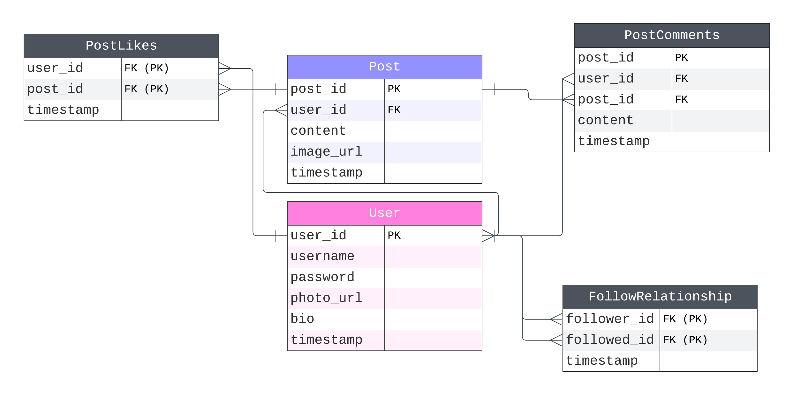

# Digigram

## Overview
Digigram is a full-stack social media web application, showcasing functionalities like user authentication, post creation, editing, and deletion, as well as account management. It's built using Spring Boot, React.js, and MySQL, and hosted on AWS.

## Quick Links
* Video Walkthrough: [YouTube](https://youtu.be/1exu7CSPijA)
* Live Demo: [Digigram](http://capstonereactfrontend.s3-website-us-east-1.amazonaws.com/)
  * Test login:
      * Username: digit
      * Password: password123

## Tech Stack
* Backend: Spring Boot (AWS Elastic Beanstalk)
* Frontend: React.js (AWS S3 Bucket)
* Database: MySQL (Amazon RDS)
* API Testing: Postman

## ERD

## Features
* User authentication system (signup, login, logout)
* Profile customization (photo, bio)
* Post functionalities (create, edit, view, delete)
* Post-likes tracking

## Development Process

### Backend
* Initialized using start.spring.io (Gradle, Java)
* RDS database connection with MySQL credentials
* MVC architecture with API endpoint mapping

### Frontend
* Developed using React.js
* Axios for backend communication
* Redux for state management

## Deployment
* Spring Boot app on AWS Elastic Beanstalk
* React app hosted on AWS S3
* Domain and endpoint management through AWS

## License
MIT License
